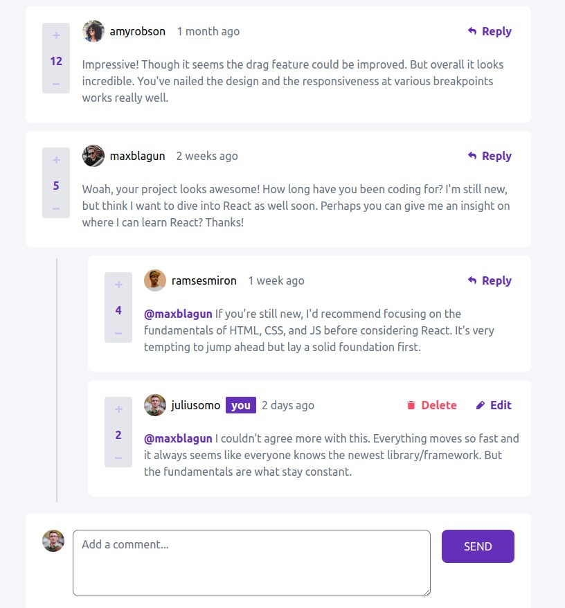

# Frontend Mentor - Interactive comments section solution

  

    
    
  

## ✨ Sobre

Solução para o [Interactive comments section challenge on Frontend Mentor](https://www.frontendmentor.io/challenges/interactive-comments-section-iG1RugEG9).

    

 

## 🤔 Como Usar

-   Acesse: `https://interactive-comments-section-eosin.vercel.app/`

-   Você pode:

    -   Fazer um novo comentario
    -   Responder os comentarios de outras pessoas
    -   Dar up vote e down vote nos cometarios
    -   Deletar seu proprio comentario

-   Você não pode:
    -   Editar seu comentario **AINDA**
